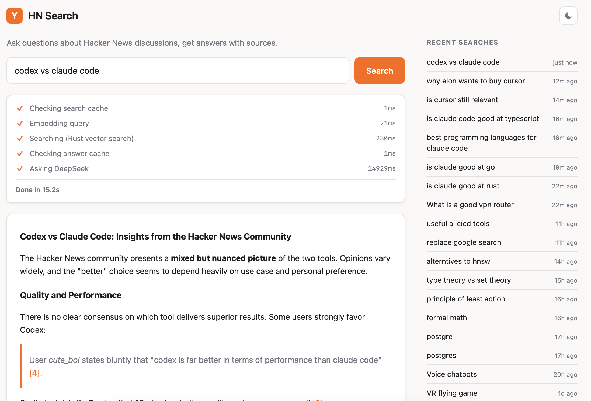

# 🔎 HN Search: Semantic Search & RAG for Hacker News

Semantic search and RAG (Retrieval-Augmented Generation) over **~12 million Hacker
News comments**, built with vector embeddings, a hand-rolled Rust brute-force vector
service, and LangGraph.

**Live demo**: [hn.fiodorov.es](https://hn.fiodorov.es)

Unlike keyword search, it uses dense vector embeddings to understand meaning, finding
relevant discussions even when exact keywords don't match — then an LLM answers your
question with cited sources.

## 🎯 Highlights

- 🔍 **Semantic search** over ~12.1M comments (2023+) with exact-cosine ranking
- 🦀 **Purpose-built Rust search service**: binary-quantized Hamming brute-force +
  float16 exact rerank over `mmap`'d flat files — **~1.1 GB RAM for 12M vectors**,
  proven **recall@10 = 1.000** vs exact cosine
- 🤖 **RAG**: LangGraph workflow + DeepSeek LLM with token streaming and citations
- ⚡ **ONNX query encoder**: serve without torch (~300 MB instead of ~1.5 GB RAM)
- 🔄 **Online updates**: daily incremental `/append`, no index rebuild
- 🔐 **Two-token auth**: read token on the public web app, admin (write) token only
  where updates run
- 💸 **~$7/mo**: replaced a 6 GB managed Postgres (~$50/mo) with a €7 Hetzner box

## 🏗️ Architecture

```
                  Railway (FastAPI web app)                Hetzner CX32 (Rust service)
  user query ──► encode (ONNX, no torch) ──► Redis cache ──┐
                                                           │  HTTPS /search {vec, k}
                                                           └──────────► binary Hamming
                                                                        shortlist (mmap)
                                                                          ↓ exact f16
                                                                        cosine rerank
                                                                          ↓
                  ◄── sources + cited answer ◄── DeepSeek LLM ◄── top-10 ── SQLite text

  daily update (laptop):  /max_id → BigQuery (id>max) → ONNX embed → HTTPS /append → tail
```

### The Rust service (`rust-search/`)

Two-stage retrieval, the same shape pgvector used — but in ~1.1 GB RAM instead of 6 GB:

1. **Stage 1 — binary Hamming shortlist.** Each 768-d embedding is sign-quantized to
   a 768-bit code (96 bytes). A rayon-parallel brute-force scan popcounts the XOR
   against the query over all 12M codes (`codes.bin`, the only *hot* file, ~1.1 GB)
   and keeps the top-200.
2. **Stage 2 — exact cosine rerank.** For those ~200 candidates only, the float16
   vectors are read from `rerank_f16.bin` (18.6 GB, `mmap`'d **cold** — only the
   touched pages load) and reranked by exact cosine.
3. **Text lookup.** The final 10 row-ids are resolved against `docs.sqlite`.

An appendable in-memory **tail** holds daily `/append` rows so they're searchable
immediately with no rebuild. Endpoints: `/search`, `/append`, `/max_id`, `/health`.
See [`rust-search/README.md`](rust-search/README.md) for build/deploy details.

**Why brute-force?** At 12M vectors a flat scan is ~25 ms — sequential, cache-friendly,
exact, and trivially appendable — versus an HNSW index that needs RAM, careful updates,
and (under partitioning) a costly merge. We traded a clever index we didn't need for a
dumb scan that's cheaper, simpler, and has guaranteed recall.

## 🛠️ Stack

- **Web/serve**: Python 3.13, FastAPI + SSE, LangGraph + LangChain, Redis, [uv](https://github.com/astral-sh/uv)
- **Search service**: Rust — axum, rayon, memmap2, rusqlite, half
- **Embeddings**: [all-mpnet-base-v2](https://huggingface.co/sentence-transformers/all-mpnet-base-v2)
  (768-d) — torch for batch embedding, **ONNX Runtime** at serve time (no torch)
- **LLM**: DeepSeek (OpenAI-compatible API)
- **Data**: [BigQuery HN public dataset](https://console.cloud.google.com/marketplace/product/y-combinator/hacker-news)
- **Infra**: Railway (web app + Redis), Hetzner Cloud (Rust service), Caddy (auto-TLS)

## 🚀 Getting Started

```bash
curl -LsSf https://astral.sh/uv/install.sh | sh   # install uv
git clone https://github.com/yourusername/hn-search.git && cd hn-search
uv sync                  # serve deps (no torch)
uv sync --extra dev      # + torch/BigQuery for batch embedding & updates

cp .env.example .env     # set HN_SEARCH_URL, HN_SEARCH_TOKEN, DEEPSEEK_API_KEY, ...
```

### Run the web app locally

```bash
cd frontend && npm install && npm run build && cd ..   # build the React UI once
uv run python -m hn_search.api                          # serves API + UI on :8000
```
Point `HN_SEARCH_URL`/`HN_SEARCH_TOKEN` at a running Rust service (local or the box).

### Run the Rust service locally

```bash
cd rust-search && cargo build --release
ARTIFACT_DIR=./artifacts PORT=8011 HN_SEARCH_TOKEN=dev ./target/release/rust-search
```

## 🔄 Updating the corpus

**Daily incremental** (run where the admin token lives — your laptop):
```bash
uv run --extra dev python misc/fetch_and_embed_new_comments.py
```
It reads the service's `/max_id`, pulls newer comments from BigQuery, embeds them on
CPU (ONNX), and POSTs to `/append`. New rows are searchable immediately.

**Full rebuild from scratch** (rare — for a fresh corpus or compaction):
```bash
make fetch        # BigQuery → data/raw/month_*.parquet
make embed        # GPU embed → data/embedded/*.parquet  (run ON a GPU box)
make artifacts    # build codes.bin / rerank_f16.bin / docs.sqlite → rust-search/artifacts
# then rsync to the box:
REMOTE=hnsearch@your-box ./rust-search/scripts/rsync_artifacts.sh rust-search/artifacts
```
The GPU box needs **no credentials** — only the public model + your raw parquet.
`misc/gpu_embed.sh` / `sync_embeddings.sh` drive a rented GPU box from your laptop.

## 🔐 Security

- **Two tokens.** `HN_SEARCH_TOKEN` (read) grants `/search` and lives on the public
  web app; `HN_SEARCH_ADMIN_TOKEN` (write) grants `/append` + `/max_id` and never
  leaves the update machine. The public tier is *structurally* read-only.
- **Network.** The service listens on localhost; Caddy terminates TLS and reverse-
  proxies; the firewall exposes only 22/80/443. The write endpoint is unreachable
  directly from the internet.

## 📊 Performance & scale

- **Corpus**: ~12.1M comments · artifacts ~25 GB (1.2 GB codes + 18.6 GB f16 + ~5 GB text)
- **Search latency**: p50 ~25 ms (full brute-force scan + rerank), vs ~550 ms for the
  old partitioned-pgvector path
- **Quality**: recall@10 = 1.000 and identical top-10 vs the previous pgvector results
- **RAM**: ~1.1 GB resident (hot binary codes); the 18.6 GB f16 stays mmap-cold
- **Caching**: Redis caches vector results, LLM answers, and dedupes concurrent jobs
- **Cost**: ~$7/mo Hetzner box, down from ~$50/mo for the 6 GB managed Postgres

## 🗂️ Project structure

```
hn-search/
├── hn_search/                 # Python web app
│   ├── search_backend.py      # HTTP client to the Rust service (keep-alive)
│   ├── common.py              # ONNX query encoder
│   ├── cache_config.py        # Redis caching
│   ├── api/                   # FastAPI (SSE search, recent queries, static UI)
│   └── rag/                   # graph.py / nodes.py / pipeline.py / cli.py / state.py
├── rust-search/               # Rust vector search service
│   ├── src/                   # quantize / index (mmap + tail) / db / main (axum)
│   ├── deploy/                # systemd unit + Caddyfile
│   └── scripts/               # rsync_artifacts.sh
├── misc/
│   ├── fetch_historical.py            # BigQuery → parquet (full rebuild)
│   ├── generate_embeddings_gpu.py     # GPU batch embedding
│   ├── build_search_artifacts.py      # parquet → artifact files
│   ├── fetch_and_embed_new_comments.py# daily incremental → /append
│   ├── verify_artifacts.py            # artifact integrity check
│   └── eval_rust_parity.py            # recall vs exact cosine
├── frontend/                  # React + Vite + TS UI
├── pyproject.toml · Makefile · Dockerfile · docker-compose.yml
```

## 🎓 What this demonstrates

- Profiling a bottleneck and replacing a general-purpose index (HNSW-in-Postgres) with
  a purpose-built **Rust brute-force vector service** — at equal recall, lower RAM, lower cost
- Binary quantization + two-stage retrieval; `mmap` so the big data stays on disk
- Online updates by file append (no index rebuild); resumable, crash-safe artifact builds
- A real cutover: env-flagged backend, live shadow comparison, then decommission
- Security posture: least-privilege read/admin tokens, TLS, localhost + firewall

## 📚 References

- [sentence-transformers](https://www.sbert.net/) · [ONNX Runtime](https://onnxruntime.ai/)
- [LangGraph](https://langchain-ai.github.io/langgraph/)
- [BigQuery HN dataset](https://console.cloud.google.com/marketplace/product/y-combinator/hacker-news)
- [RAG (Lewis et al., 2020)](https://arxiv.org/abs/2005.11401)

## 📄 License

MIT — see LICENSE.


